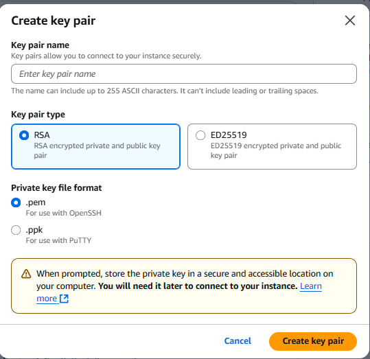

### ✅ Getting Started with Your First Cloud Server

#### **Step 1: Create a New EC2 Instance**

To begin, log in to the AWS Console at [https://console.aws.amazon.com](https://console.aws.amazon.com).

In the AWS Management Console, locate the search bar at the top and type "EC2." Click on the **EC2** result to go to the EC2 Dashboard.

On the EC2 Dashboard, click the orange **Launch Instance** button.

You’ll be taken to the configuration page. Here’s what to fill in:

1. **Name and Tags**

   Name your instance. We used `Test` in this guide, but you can name it anything you want.

   

2. **Application and OS Images (Amazon Machine Image)**

   Select **Amazon Linux 2 AMI (HVM), SSD Volume Type**

   

3. **Instance Type**

   Choose **t2.micro** if you're using the free tier

4. **Key Pair (Login)**

   Choose **Create new key pair**

   Name it something like `Test` — we used `Test`, but you can use any name.

   Select **.pem** format (especially if you're on Linux/macOS)

   Click **Create key pair**

   Note: The `.pem` file will download automatically in your browser. Keep it safe. This is your only way to log in to your instance.

   
   

5. **Network Settings**

   Expand this section

   Make sure **SSH (port 22)** and **HTTP (port 80)** are allowed

   Note: If these ports aren’t enabled, you won’t be able to SSH into your server or view the website later. Double-check before continuing.

   

6. Leave the remaining settings as-is

7. Click **Launch Instance** at the bottom of the page

   

You’ll be redirected to a confirmation screen showing your instance is launching.

---

#### **Step 2: Connect to Your EC2 via SSH (Linux/macOS)**

Open your terminal (Linux/macOS) or Git Bash/WSL (on Windows). Navigate to the folder where your `.pem` file is stored.

Run this command to set permissions:

```bash
chmod 400 Test.pem
```

Note: If you're using a browser, the `.pem` file should be located in your Downloads folder unless you specified a different path.

Note: If you're not in the same folder as your `.pem` file, you must provide the full path. For example:

```bash
ssh -i /home/kali/PEM/Test.pem ec2-user@18.226.185.195
```

Example:

```bash
ssh -i Test.pem ec2-user@18.226.185.195
```


---

#### **Step 2.1: (Windows Alternative) Connect with PowerShell**

If you're using Windows and prefer PowerShell over Git Bash or WSL, you can also connect to your EC2 instance using the following format:

```powershell
ssh -i "C:\Users\yourusername\Downloads\Test.pem" ec2-user@<your-ec2-public-ip>
```

Make sure to:

* Replace `yourusername` with your actual Windows username.
* Provide the correct path to your `.pem` file.

When you run the command for the first time, you'll see a prompt about adding the host. Type `yes` to continue.


Note: Once you're inside the AWS terminal via SSH (whether PowerShell or Linux terminal), the remaining steps are the same because you're working within the same Linux EC2 environment.

---

#### **Step 3: Install NGINX Web Server**

Once logged in via SSH, run the following commands:

```bash
sudo yum update -y
sudo amazon-linux-extras enable nginx1
sudo yum install -y nginx
sudo systemctl start nginx
sudo systemctl enable nginx
```

Note: `yum` is the package manager for Amazon Linux. `systemctl` is used to control system services.

Note: The installation process will output more content than shown here. That's normal.


---

#### **Step 4: Test in Your Browser**

Open your browser and go to:

```
http://<your-public-ip>
```

You should see the default **NGINX Welcome Page** if everything was successful.


---

#### **Optional: Send Files to EC2**

If you need to upload a file to your EC2 instance (e.g., a script), use:

```bash
scp -i /path/to/Test.pem your-file.sh ec2-user@<your-ec2-public-ip>:/home/ec2-user/
```

Note: If your `.pem` file is stored in a different directory (like `/home/kali/PEM/`), use that full path:

```bash
scp -i /home/kali/PEM/Test.pem setup-nginx.sh ec2-user@<your-ec2-public-ip>:/home/ec2-user/
```

Note: If the upload fails with "Permission denied", double check the IP is correct, the `.pem` file exists at the given path, and you're using `ec2-user` as the login.

---

✅ *Next steps will cover hardening the server and managing deployment (firewall config, HTTPS setup, file permissions, etc.)*

---

### TL;DR Summary

* **Create EC2 Instance:** Launch Amazon Linux 2 with default settings, open SSH & HTTP ports.
* **Key Pair:** Download your `.pem` file (only once!) — this is your login key.
* **SSH (Linux):** Use `chmod 400` and connect via `ssh -i path/to/key.pem ec2-user@<public-ip>`
* **SSH (PowerShell):** Use `ssh -i "C:\\Users\\yourusername\\Downloads\\Test.pem" ec2-user@<public-ip>`
* **Install Web Server:** Run `yum update`, enable/install NGINX, then start the service.
* **Test:** Go to `http://<your-public-ip>` to view the default NGINX page.
* **Upload Files (Optional):** Use `scp` with your `.pem` file to send scripts/files to EC2.
